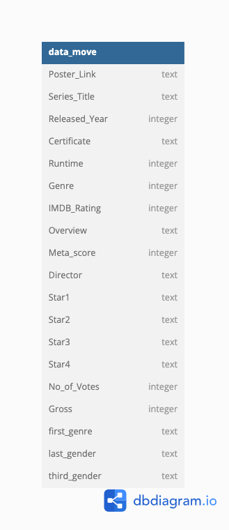
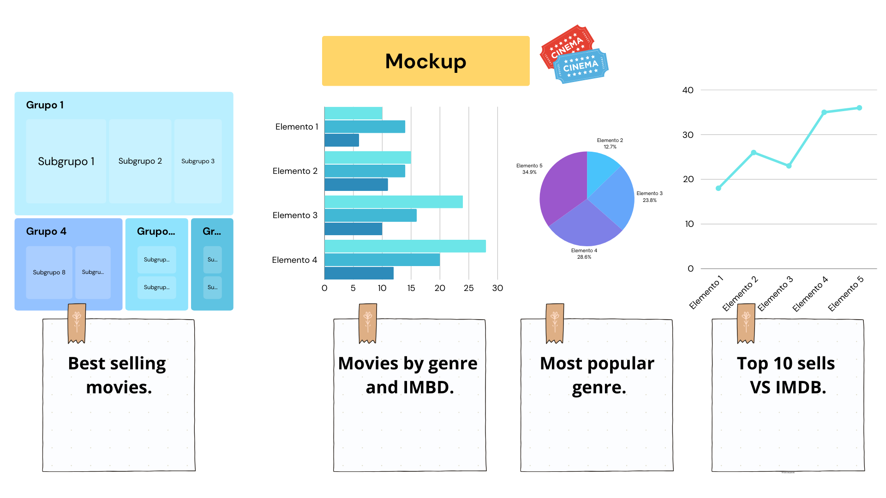

# Find your movie.

Are you tired of not knowing what movie to watch? Do you argue over what movie to play? With this dashboards I will help you finding the best movie and your only concern will be to find will be chosing the best type of popcorn.

- BI Report/Dashboard: 

https://public.tableau.com/views/Encuentratupelcula_1920-2020/Story1?:language=es-ES&publish=yes&:display_count=n&:origin=viz_share_link

## :footprints: First steps.

This is the project for the second module of Inronhack's Bootcamp.

## :stuck_out_tongue_winking_eye: Dashboard:

In this dashboard we work with data from movies between years 1920 and 2000, we help you finding that movie you missed and always wanted to watch.

## :thought_balloon: What does the project do?

You can see all the movies at a glance filtering by the genre you like the most and choose the top 10 based on the IMBD rating.

- Movies by genre and IMBD.

- Top 10 movies.

- Top 10 sells VS IMDB.

- Directors VS money.

- Best selling movies.

- Most popular genre.

## :movie_camera: Additionally:

- Data model:



- Functional design mockup:


- BI Report/Dashboard: 

https://public.tableau.com/views/Encuentratupelcula_1920-2020/Story1?:language=es-ES&publish=yes&:display_count=n&:origin=viz_share_link

## 	:see_no_evil: Project structure:

``` bash
Proyect_m2/
│── data
│   ├── data_movie.csv
│   ├── imdb_top_1000.csv
│   ├── untitled.txt
│   └── visualizacion data.ipynb
├── images
│   ├── data_model.png
│   └── fondo.jpeg
├── .gitignore
├── LICENSE
├── main.py
└── README.md
```


